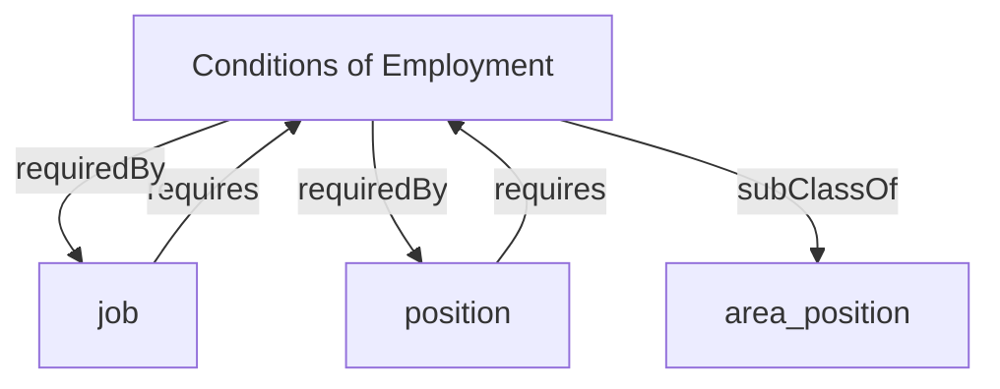

## Related Links

- [[area_position]]
- [[conditions_of_employment]]
- [[job]]
- [[position]]

## Semantic Connections

```mermaid
graph TD
  Conditions_of_Employment["Conditions of Employment"]:::current-page-node
  area_position["area_position"]
  job["job"]
  position["position"]
  job-->|" requires "|Conditions_of_Employment
  position-->|" requires "|Conditions_of_Employment
  Conditions_of_Employment-->|" requiredBy "|job
  Conditions_of_Employment-->|" requiredBy "|position
  Conditions_of_Employment-->|" subClassOf "|area_position
```
