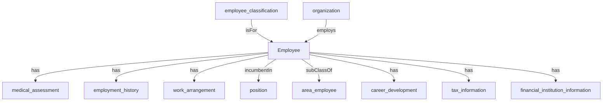

## Related Links

- [[area_employee]]
- [[career_development]]
- [[employee]]
- [[employee_classification]]
- [[employment_history]]
- [[financial_institution_information]]
- [[medical_assessment]]
- [[organization]]
- [[position]]
- [[tax_information]]
- [[work_arrangement]]

## Semantic Connections

