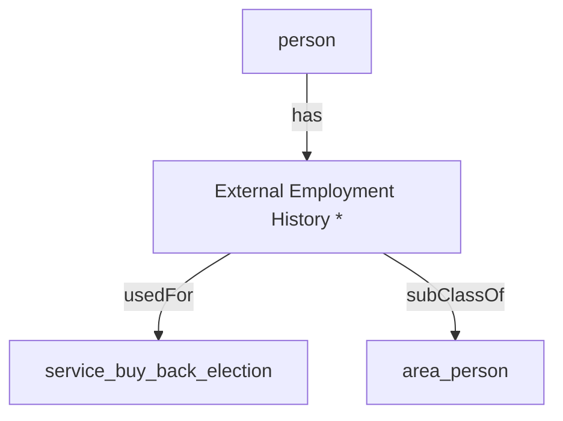

## Related Links

- [[area_person]]
- [[person]]
- [[service_buy_back_election]]

## Semantic Connections

```mermaid
graph TD
  External_Employment_History_["External Employment History *"]:::current-page-node
  area_person["area_person"]
  service_buy_back_election["service_buy_back_election"]
  person["person"]
  person-->|" has "|External_Employment_History_
  External_Employment_History_-->|" usedFor "|service_buy_back_election
  External_Employment_History_-->|" subClassOf "|area_person
```
