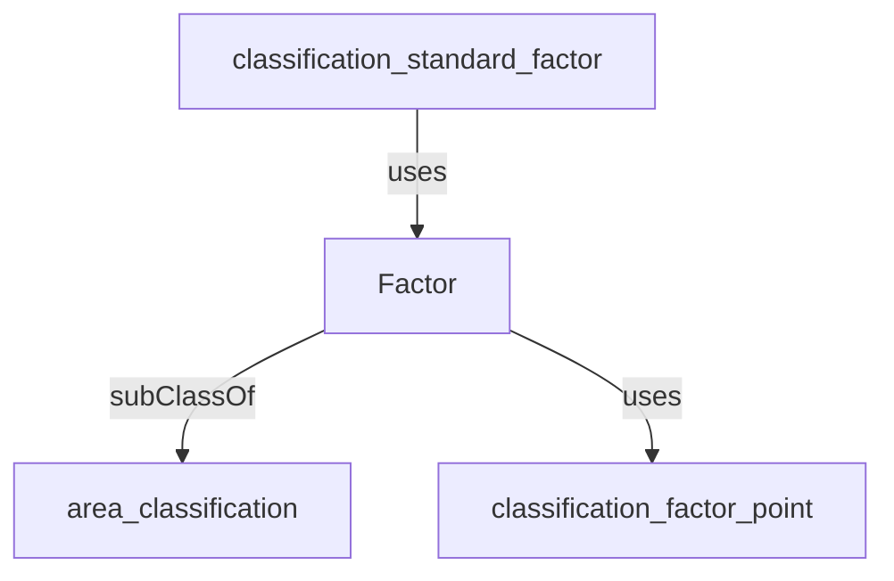

## Related Links

- [[area_classification]]
- [[classification_standard_factor]]
- [[factor]]

## Semantic Connections

```mermaid
graph TD
  Factor["Factor"]:::current-page-node
  area_classification["area_classification"]
  classification_factor_point["classification_factor_point"]
  classification_standard_factor["classification_standard_factor"]
  Factor-->|" subClassOf "|area_classification
  classification_standard_factor-->|" uses "|Factor
  Factor-->|" uses "|classification_factor_point
```
