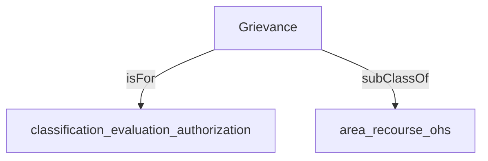

## Related Links

- [[area_recourse_ohs]]
- [[classification_evaluation_authorization]]
- [[grievance]]

## Semantic Connections

```mermaid
graph TD
  Grievance["Grievance"]:::current-page-node
  area_recourse_ohs["area_recourse_ohs"]
  classification_evaluation_authorization["classification_evaluation_authorization"]
  Grievance-->|" isFor "|classification_evaluation_authorization
  Grievance-->|" subClassOf "|area_recourse_ohs
```
