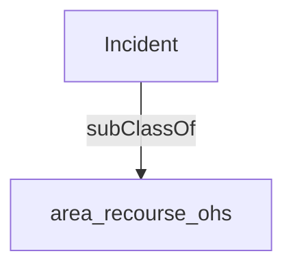

## Related Links

- [[area_recourse_ohs]]
- [[incident]]

## Semantic Connections

```mermaid
graph TD
  Incident["Incident"]:::current-page-node
  area_recourse_ohs["area_recourse_ohs"]
  Incident-->|" subClassOf "|area_recourse_ohs
```
