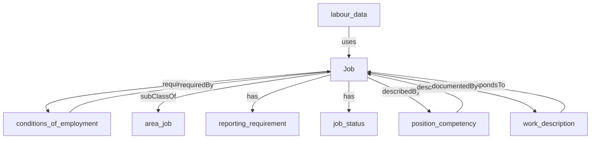

## Related Links

- [[area_job]]
- [[conditions_of_employment]]
- [[job_status]]
- [[labour_data]]
- [[position_competency]]
- [[reporting_requirement]]
- [[work_description]]

## Semantic Connections

