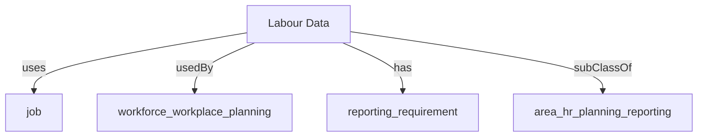

## Related Links

- [[area_hr_planning_reporting]]
- [[job]]
- [[labour_data]]
- [[reporting_requirement]]
- [[workforce_workplace_planning]]

## Semantic Connections

```mermaid
graph TD
  Labour_Data["Labour Data"]:::current-page-node
  area_hr_planning_reporting["area_hr_planning_reporting"]
  reporting_requirement["reporting_requirement"]
  workforce_workplace_planning["workforce_workplace_planning"]
  job["job"]
  Labour_Data-->|" uses "|job
  Labour_Data-->|" usedBy "|workforce_workplace_planning
  Labour_Data-->|" has "|reporting_requirement
  Labour_Data-->|" subClassOf "|area_hr_planning_reporting
```
