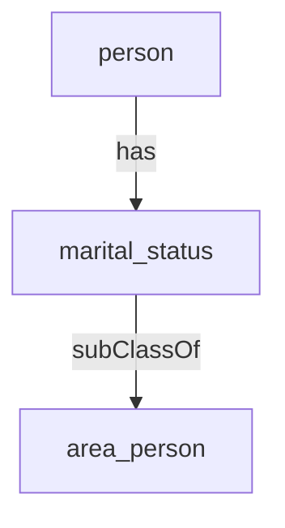

## Related Links

- [[area_person]]
- [[marital_status]]
- [[person]]

## Semantic Connections

```mermaid
graph TD
  marital_status["marital_status"]:::current-page-node
  area_person["area_person"]
  person["person"]
  person-->|" has "|marital_status
  marital_status-->|" subClassOf "|area_person
```
