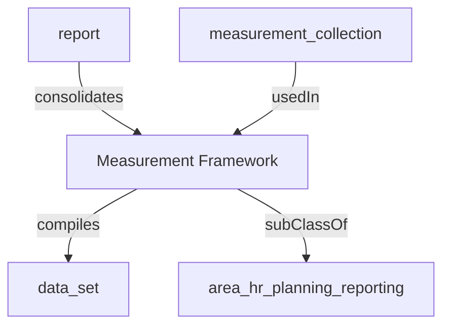

## Related Links

- [[area_hr_planning_reporting]]
- [[data_set]]
- [[measurement_collection]]
- [[measurement_framework]]
- [[report]]

## Semantic Connections

```mermaid
graph TD
  Measurement_Framework["Measurement Framework"]:::current-page-node
  area_hr_planning_reporting["area_hr_planning_reporting"]
  data_set["data_set"]
  measurement_collection["measurement_collection"]
  report["report"]
  report-->|" consolidates "|Measurement_Framework
  Measurement_Framework-->|" compiles "|data_set
  measurement_collection-->|" usedIn "|Measurement_Framework
  Measurement_Framework-->|" subClassOf "|area_hr_planning_reporting
```
