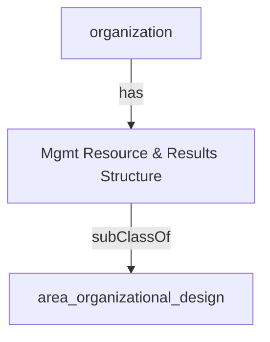

## Related Links

- [[area_organizational_design]]
- [[mgmt_resource_results_structure]]
- [[organization]]

## Semantic Connections

```mermaid
graph TD
  Mgmt_Resource__Results_Structure["Mgmt Resource & Results Structure"]:::current-page-node
  area_organizational_design["area_organizational_design"]
  organization["organization"]
  organization-->|" has "|Mgmt_Resource__Results_Structure
  Mgmt_Resource__Results_Structure-->|" subClassOf "|area_organizational_design
```
