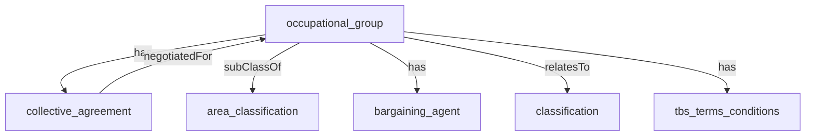

## Related Links

- [[area_classification]]
- [[bargaining_agent]]
- [[classification]]
- [[collective_agreement]]

## Semantic Connections

```mermaid
graph TD
  occupational_group["occupational_group"]:::current-page-node
  area_classification["area_classification"]
  bargaining_agent["bargaining_agent"]
  collective_agreement["collective_agreement"]
  tbs_terms_conditions["tbs_terms_conditions"]
  classification["classification"]
  occupational_group-->|" has "|collective_agreement
  occupational_group-->|" subClassOf "|area_classification
  occupational_group-->|" has "|bargaining_agent
  collective_agreement-->|" negotiatedFor "|occupational_group
  occupational_group-->|" relatesTo "|classification
  occupational_group-->|" has "|tbs_terms_conditions
```
