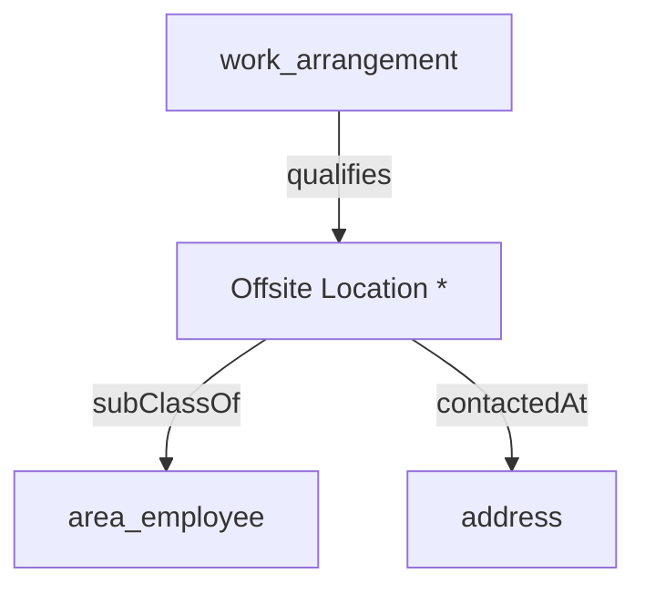

## Related Links

- [[address]]
- [[area_employee]]
- [[work_arrangement]]

## Semantic Connections

```mermaid
graph TD
  Offsite_Location_["Offsite Location *"]:::current-page-node
  area_employee["area_employee"]
  address["address"]
  work_arrangement["work_arrangement"]
  Offsite_Location_-->|" subClassOf "|area_employee
  work_arrangement-->|" qualifies "|Offsite_Location_
  Offsite_Location_-->|" contactedAt "|address
```
