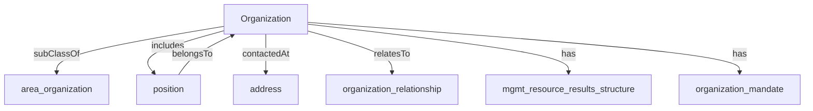

## Related Links

- [[address]]
- [[area_organization]]
- [[mgmt_resource_results_structure]]
- [[organization]]
- [[organization_relationship]]
- [[position]]

## Semantic Connections

```mermaid
graph TD
  Organization["Organization"]:::current-page-node
  area_organization["area_organization"]
  address["address"]
  mgmt_resource_results_structure["mgmt_resource_results_structure"]
  organization_mandate["organization_mandate"]
  position["position"]
  organization_relationship["organization_relationship"]
  Organization-->|" subClassOf "|area_organization
  Organization-->|" includes "|position
  Organization-->|" contactedAt "|address
  Organization-->|" relatesTo "|organization_relationship
  Organization-->|" has "|mgmt_resource_results_structure
  Organization-->|" has "|organization_mandate
  position-->|" belongsTo "|Organization
```
