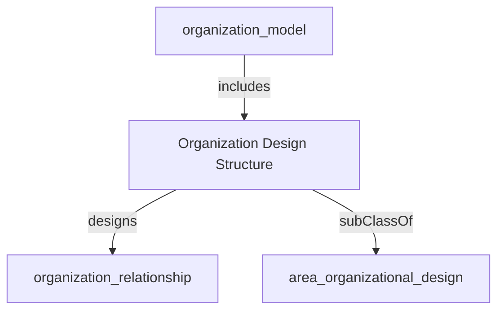

## Related Links

- [[area_organizational_design]]
- [[organization_design_structure]]
- [[organization_model]]
- [[organization_relationship]]

## Semantic Connections

```mermaid
graph TD
  Organization_Design_Structure["Organization Design Structure"]:::current-page-node
  area_organizational_design["area_organizational_design"]
  organization_relationship["organization_relationship"]
  organization_model["organization_model"]
  Organization_Design_Structure-->|" designs "|organization_relationship
  Organization_Design_Structure-->|" subClassOf "|area_organizational_design
  organization_model-->|" includes "|Organization_Design_Structure
```
