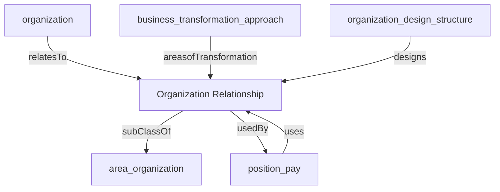

## Related Links

- [[area_organization]]
- [[business_transformation_approach]]
- [[organization]]
- [[organization_design_structure]]
- [[organization_relationship]]
- [[position_pay]]

## Semantic Connections

