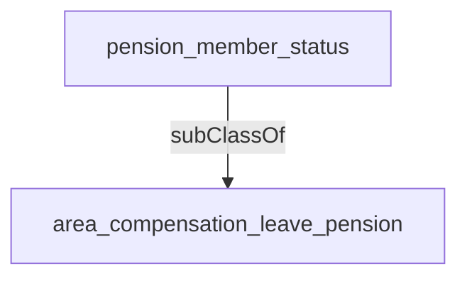

## Related Links

- [[area_compensation_leave_pension]]
- [[pension_member_status]]

## Semantic Connections

```mermaid
graph TD
  pension_member_status["pension_member_status"]:::current-page-node
  area_compensation_leave_pension["area_compensation_leave_pension"]
  pension_member_status-->|" subClassOf "|area_compensation_leave_pension
```
