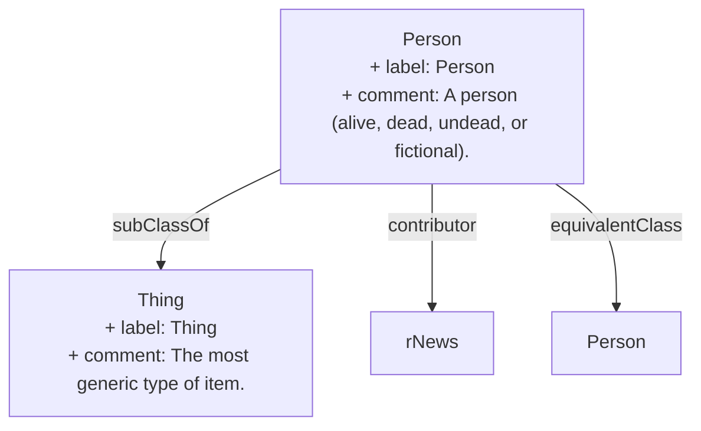

## Related Links

- [[Thing]]

## Semantic Connections

```mermaid
graph TD
  Person["Person<br>+ label: Person<br>+ comment: A person (alive, dead, undead, or fictional)."]:::current-page-node
  Thing["Thing<br>+ label: Thing<br>+ comment: The most generic type of item."]
  Person_1["Person"]
  rNews["rNews"]
  Person-->|" subClassOf "|Thing
  Person-->|" contributor "|rNews
  Person-->|" equivalentClass "|Person_1
```
