## Related Links

- [[Membership]]
- [[address]]
- [[area_person]]
- [[employment_equity_designated_group_membership]]
- [[external_employment_history]]
- [[language_evaluation]]
- [[marital_status]]
- [[person]]
- [[person_competency]]
- [[person_education]]
- [[person_email]]
- [[person_license_certification]]
- [[person_name]]
- [[person_preference]]
- [[security_clearance]]
- [[self_identification_group_membership]]
- [[telephone]]
- [[workplace_accessibility_requirement]]

## Semantic Connections

```mermaid
graph TD
  Person["Person"]:::current-page-node
  area_person["area_person"]
  language_evaluation["language_evaluation"]
  address["address"]
  person_email["person_email"]
  telephone["telephone"]
  external_employment_history["external_employment_history"]
  marital_status["marital_status"]
  person_competency["person_competency"]
  person_education["person_education"]
  person_preference["person_preference"]
  security_clearance["security_clearance"]
  workplace_accessibility_requirement["workplace_accessibility_requirement"]
  person_license_certification["person_license_certification"]
  Membership["Membership"]
  employment_equity_designated_group_membership["employment_equity_designated_group_membership"]
  self_identification_group_membership["self_identification_group_membership"]
  person_name["person_name"]
  Person-->|" contactedAt "|address
  Person-->|" has "|person_education
  Person-->|" has "|external_employment_history
  Person-->|" has "|security_clearance
  Person-->|" memberOf "|employment_equity_designated_group_membership
  Person-->|" subClassOf "|area_person
  Person-->|" memberOf "|Membership
  Person-->|" has "|marital_status
  Person-->|" named "|person_name
  Person-->|" licensed "|person_license_certification
  Person-->|" has "|person_preference
  Person-->|" memberOf "|self_identification_group_membership
  Person-->|" contactedAt "|person_email
  Person-->|" assessedBy "|language_evaluation
  Person-->|" has "|person_competency
  Person-->|" contactedAt "|telephone
  Person-->|" has "|workplace_accessibility_requirement
```

