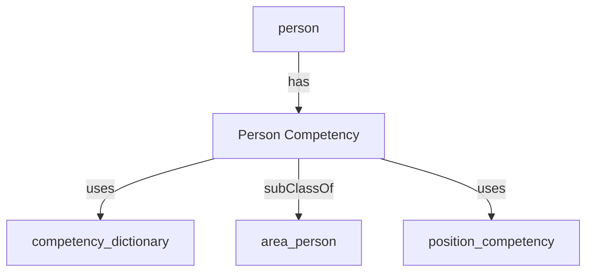

## Related Links

- [[area_person]]
- [[competency_dictionary]]
- [[person]]
- [[person_competency]]
- [[position_competency]]

## Semantic Connections

```mermaid
graph TD
  Person_Competency["Person Competency"]:::current-page-node
  area_person["area_person"]
  competency_dictionary["competency_dictionary"]
  position_competency["position_competency"]
  person["person"]
  Person_Competency-->|" uses "|competency_dictionary
  Person_Competency-->|" subClassOf "|area_person
  person-->|" has "|Person_Competency
  Person_Competency-->|" uses "|position_competency
```
