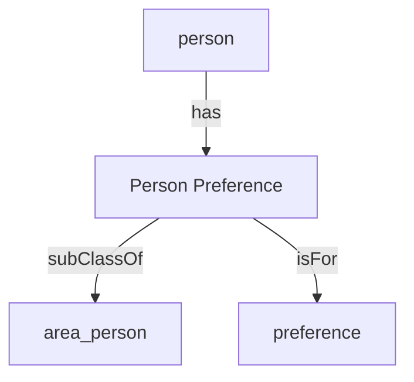

## Related Links

- [[area_person]]
- [[person]]
- [[preference]]

## Semantic Connections

```mermaid
graph TD
  Person_Preference["Person Preference"]:::current-page-node
  area_person["area_person"]
  preference["preference"]
  person["person"]
  Person_Preference-->|" subClassOf "|area_person
  person-->|" has "|Person_Preference
  Person_Preference-->|" isFor "|preference
```
