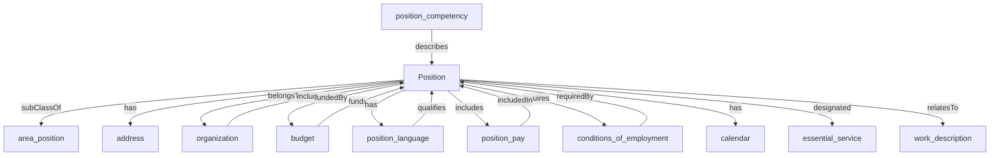

## Related Links

- [[address]]
- [[area_position]]
- [[budget]]
- [[calendar]]
- [[conditions_of_employment]]
- [[essential_service]]
- [[organization]]
- [[position_competency]]
- [[position_language]]
- [[position_pay]]
- [[work_description]]

## Semantic Connections

