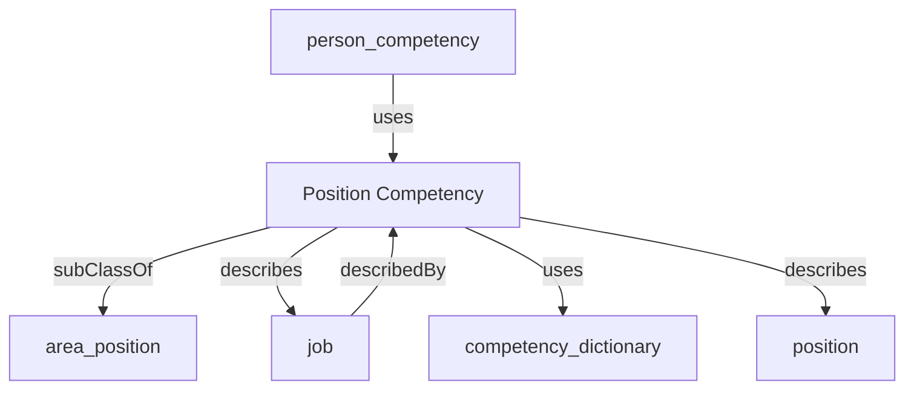

## Related Links

- [[area_position]]
- [[competency_dictionary]]
- [[job]]
- [[person_competency]]
- [[position]]
- [[position_competency]]

## Semantic Connections

```mermaid
graph TD
  Position_Competency["Position Competency"]:::current-page-node
  area_position["area_position"]
  job["job"]
  position["position"]
  competency_dictionary["competency_dictionary"]
  person_competency["person_competency"]
  Position_Competency-->|" subClassOf "|area_position
  person_competency-->|" uses "|Position_Competency
  Position_Competency-->|" describes "|job
  Position_Competency-->|" uses "|competency_dictionary
  job-->|" describedBy "|Position_Competency
  Position_Competency-->|" describes "|position
```
