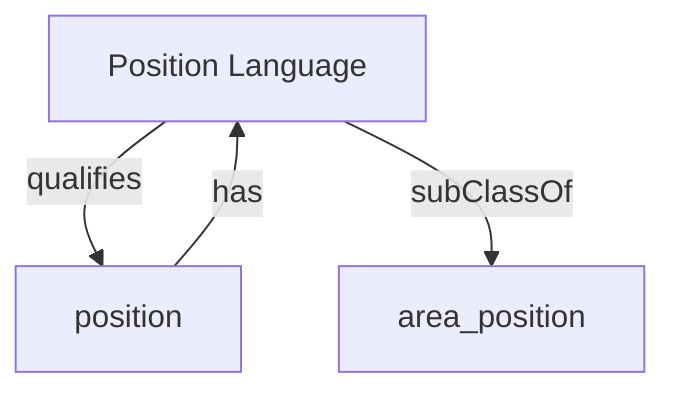

## Related Links

- [[area_position]]
- [[position]]

## Semantic Connections

```mermaid
graph TD
  Position_Language["Position Language"]:::current-page-node
  area_position["area_position"]
  position["position"]
  Position_Language-->|" qualifies "|position
  Position_Language-->|" subClassOf "|area_position
  position-->|" has "|Position_Language
```
