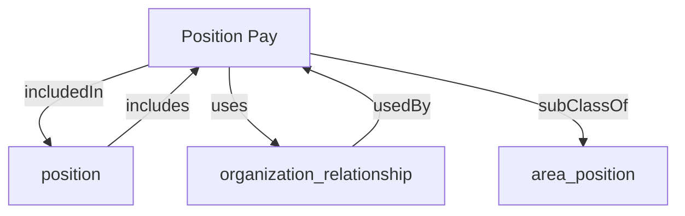

## Related Links

- [[area_position]]
- [[organization_relationship]]
- [[position]]

## Semantic Connections

```mermaid
graph TD
  Position_Pay["Position Pay"]:::current-page-node
  area_position["area_position"]
  position["position"]
  organization_relationship["organization_relationship"]
  Position_Pay-->|" includedIn "|position
  Position_Pay-->|" uses "|organization_relationship
  Position_Pay-->|" subClassOf "|area_position
  position-->|" includes "|Position_Pay
  organization_relationship-->|" usedBy "|Position_Pay
```
