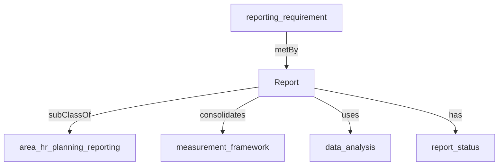

## Related Links

- [[area_hr_planning_reporting]]
- [[data_analysis]]
- [[measurement_framework]]
- [[report]]
- [[report_status]]
- [[reporting_requirement]]

## Semantic Connections

```mermaid
graph TD
  Report["Report"]:::current-page-node
  area_hr_planning_reporting["area_hr_planning_reporting"]
  measurement_framework["measurement_framework"]
  report_status["report_status"]
  data_analysis["data_analysis"]
  reporting_requirement["reporting_requirement"]
  reporting_requirement-->|" metBy "|Report
  Report-->|" subClassOf "|area_hr_planning_reporting
  Report-->|" consolidates "|measurement_framework
  Report-->|" uses "|data_analysis
  Report-->|" has "|report_status
```
