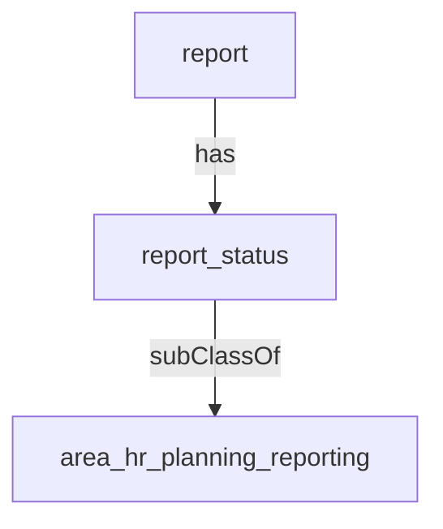

## Related Links

- [[area_hr_planning_reporting]]
- [[report]]
- [[report_status]]

## Semantic Connections

```mermaid
graph TD
  report_status["report_status"]:::current-page-node
  area_hr_planning_reporting["area_hr_planning_reporting"]
  report["report"]
  report_status-->|" subClassOf "|area_hr_planning_reporting
  report-->|" has "|report_status
```
