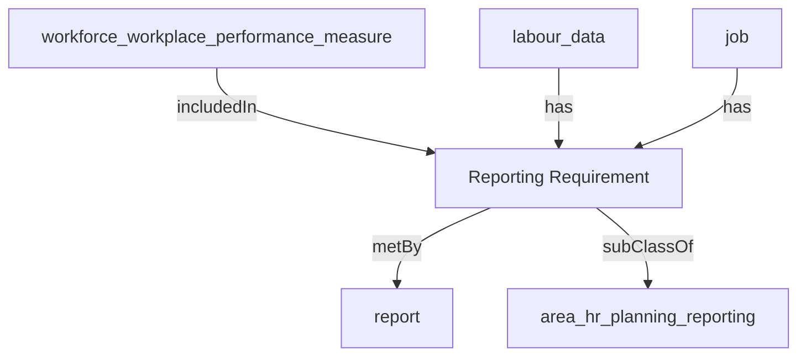

## Related Links

- [[area_hr_planning_reporting]]
- [[job]]
- [[labour_data]]
- [[report]]
- [[reporting_requirement]]
- [[workforce_workplace_performance_measure]]

## Semantic Connections

```mermaid
graph TD
  Reporting_Requirement["Reporting Requirement"]:::current-page-node
  area_hr_planning_reporting["area_hr_planning_reporting"]
  report["report"]
  workforce_workplace_performance_measure["workforce_workplace_performance_measure"]
  labour_data["labour_data"]
  job["job"]
  workforce_workplace_performance_measure-->|" includedIn "|Reporting_Requirement
  Reporting_Requirement-->|" metBy "|report
  labour_data-->|" has "|Reporting_Requirement
  Reporting_Requirement-->|" subClassOf "|area_hr_planning_reporting
  job-->|" has "|Reporting_Requirement
```
