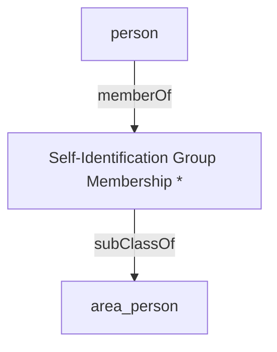

## Related Links

- [[area_person]]
- [[person]]

## Semantic Connections

```mermaid
graph TD
  Self_Identification_Group_Membership_["Self-Identification Group Membership *"]:::current-page-node
  area_person["area_person"]
  person["person"]
  person-->|" memberOf "|Self_Identification_Group_Membership_
  Self_Identification_Group_Membership_-->|" subClassOf "|area_person
```
