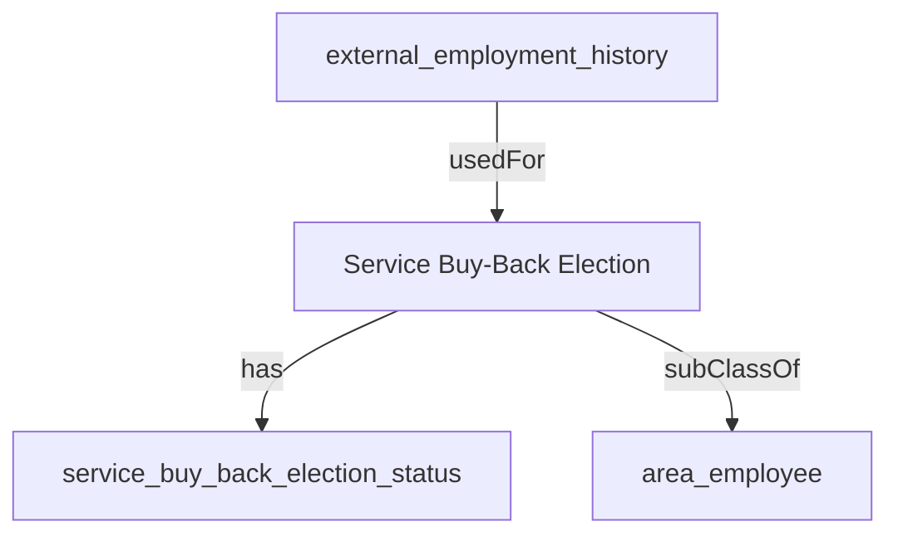

## Related Links

- [[area_employee]]
- [[external_employment_history]]
- [[service_buy_back_election_status]]

## Semantic Connections

```mermaid
graph TD
  Service_Buy_Back_Election["Service Buy-Back Election"]:::current-page-node
  area_employee["area_employee"]
  service_buy_back_election_status["service_buy_back_election_status"]
  external_employment_history["external_employment_history"]
  Service_Buy_Back_Election-->|" has "|service_buy_back_election_status
  external_employment_history-->|" usedFor "|Service_Buy_Back_Election
  Service_Buy_Back_Election-->|" subClassOf "|area_employee
```
