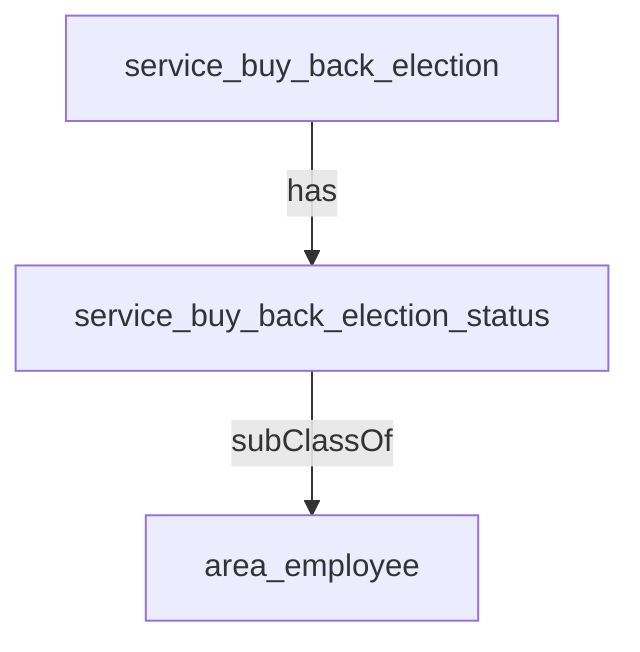

## Related Links

- [[area_employee]]
- [[service_buy_back_election]]

## Semantic Connections

```mermaid
graph TD
  service_buy_back_election_status["service_buy_back_election_status"]:::current-page-node
  area_employee["area_employee"]
  service_buy_back_election["service_buy_back_election"]
  service_buy_back_election-->|" has "|service_buy_back_election_status
  service_buy_back_election_status-->|" subClassOf "|area_employee
```
