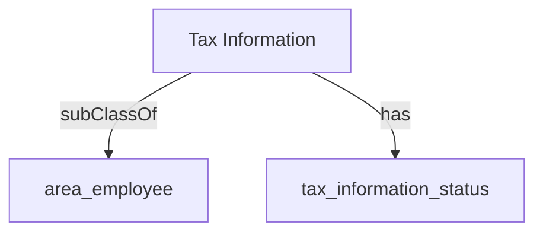

## Related Links

- [[area_employee]]
- [[tax_information_status]]

## Semantic Connections

```mermaid
graph TD
  Tax_Information["Tax Information"]:::current-page-node
  area_employee["area_employee"]
  tax_information_status["tax_information_status"]
  Tax_Information-->|" subClassOf "|area_employee
  Tax_Information-->|" has "|tax_information_status
```
