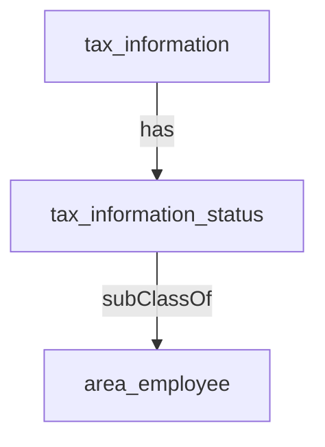

## Related Links

- [[area_employee]]
- [[tax_information]]

## Semantic Connections

```mermaid
graph TD
  tax_information_status["tax_information_status"]:::current-page-node
  area_employee["area_employee"]
  tax_information["tax_information"]
  tax_information_status-->|" subClassOf "|area_employee
  tax_information-->|" has "|tax_information_status
```
