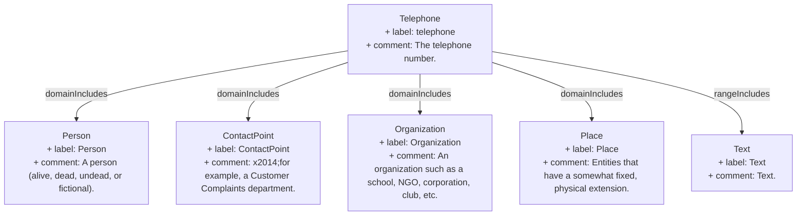

## Related Links

- [[Organization]]
- [[Person]]
- [[Place]]

## Semantic Connections

```mermaid
graph TD
  Telephone["Telephone<br>+ label: telephone<br>+ comment: The telephone number."]:::current-page-node
  ContactPoint["ContactPoint<br>+ label: ContactPoint<br>+ comment: x2014;for example, a Customer Complaints department."]
  Organization["Organization<br>+ label: Organization<br>+ comment: An organization such as a school, NGO, corporation, club, etc."]
  Person["Person<br>+ label: Person<br>+ comment: A person (alive, dead, undead, or fictional)."]
  Place["Place<br>+ label: Place<br>+ comment: Entities that have a somewhat fixed, physical extension."]
  Text["Text<br>+ label: Text<br>+ comment:  Text."]
  Telephone-->|" domainIncludes "|Person
  Telephone-->|" domainIncludes "|ContactPoint
  Telephone-->|" domainIncludes "|Organization
  Telephone-->|" domainIncludes "|Place
  Telephone-->|" rangeIncludes "|Text
```
