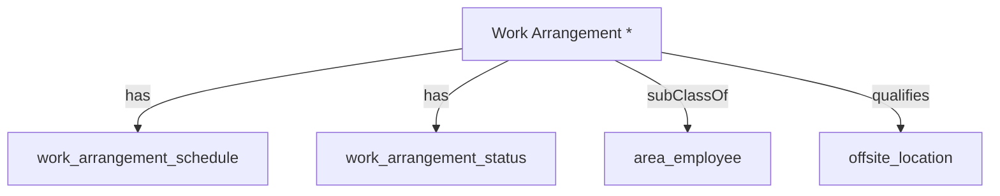

## Related Links

- [[area_employee]]
- [[offsite_location]]
- [[work_arrangement_schedule]]
- [[work_arrangement_status]]

## Semantic Connections

```mermaid
graph TD
  Work_Arrangement_["Work Arrangement *"]:::current-page-node
  area_employee["area_employee"]
  work_arrangement_schedule["work_arrangement_schedule"]
  work_arrangement_status["work_arrangement_status"]
  offsite_location["offsite_location"]
  Work_Arrangement_-->|" has "|work_arrangement_schedule
  Work_Arrangement_-->|" has "|work_arrangement_status
  Work_Arrangement_-->|" subClassOf "|area_employee
  Work_Arrangement_-->|" qualifies "|offsite_location
```
