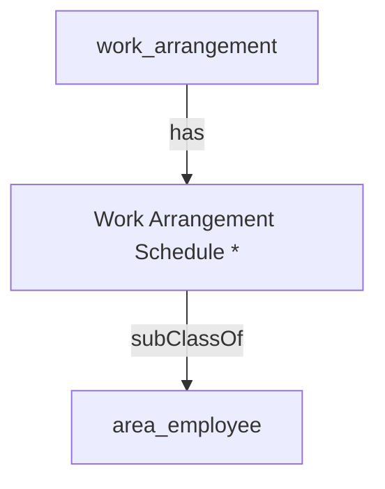

## Related Links

- [[area_employee]]
- [[work_arrangement]]
- [[work_arrangement_schedule]]

## Semantic Connections

```mermaid
graph TD
  Work_Arrangement_Schedule_["Work Arrangement Schedule *"]:::current-page-node
  area_employee["area_employee"]
  work_arrangement["work_arrangement"]
  Work_Arrangement_Schedule_-->|" subClassOf "|area_employee
  work_arrangement-->|" has "|Work_Arrangement_Schedule_
```
