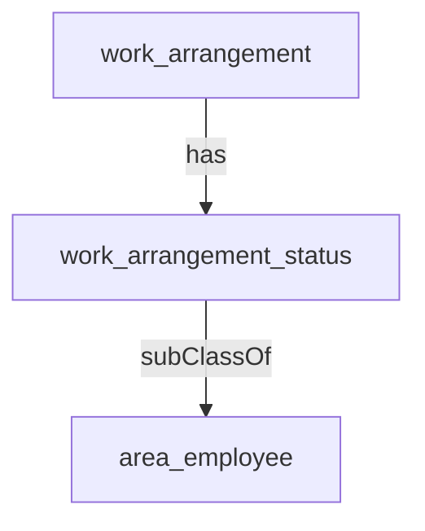

## Related Links

- [[area_employee]]
- [[work_arrangement]]

## Semantic Connections

```mermaid
graph TD
  work_arrangement_status["work_arrangement_status"]:::current-page-node
  area_employee["area_employee"]
  work_arrangement["work_arrangement"]
  work_arrangement_status-->|" subClassOf "|area_employee
  work_arrangement-->|" has "|work_arrangement_status
```
