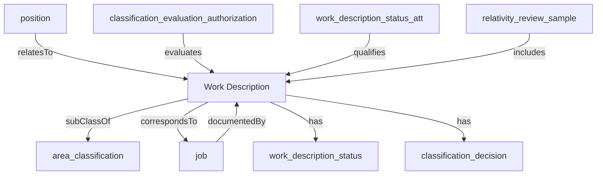

## Related Links

- [[area_classification]]
- [[classification_decision]]
- [[classification_evaluation_authorization]]
- [[job]]
- [[position]]
- [[relativity_review_sample]]
- [[work_description_status]]

## Semantic Connections

