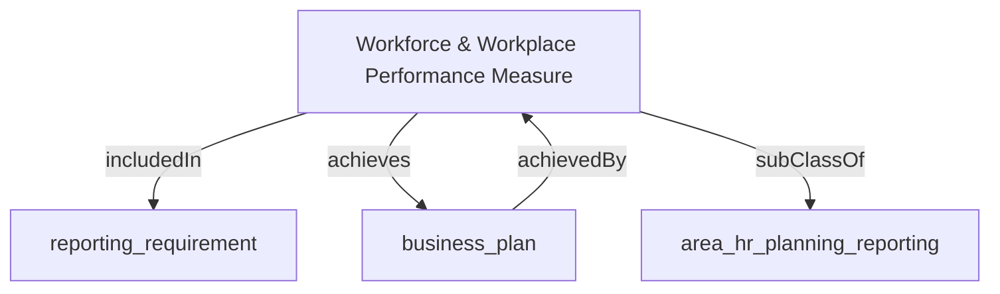

## Related Links

- [[area_hr_planning_reporting]]
- [[business_plan]]
- [[reporting_requirement]]

## Semantic Connections

```mermaid
graph TD
  Workforce__Workplace_Performance_Measure["Workforce & Workplace Performance Measure"]:::current-page-node
  area_hr_planning_reporting["area_hr_planning_reporting"]
  business_plan["business_plan"]
  reporting_requirement["reporting_requirement"]
  Workforce__Workplace_Performance_Measure-->|" includedIn "|reporting_requirement
  Workforce__Workplace_Performance_Measure-->|" achieves "|business_plan
  business_plan-->|" achievedBy "|Workforce__Workplace_Performance_Measure
  Workforce__Workplace_Performance_Measure-->|" subClassOf "|area_hr_planning_reporting
```
