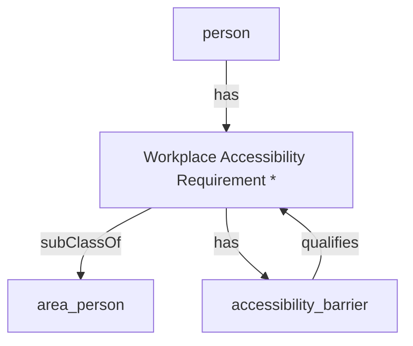

## Related Links

- [[accessibility_barrier]]
- [[area_person]]
- [[person]]

## Semantic Connections

```mermaid
graph TD
  Workplace_Accessibility_Requirement_["Workplace Accessibility Requirement *"]:::current-page-node
  area_person["area_person"]
  accessibility_barrier["accessibility_barrier"]
  person["person"]
  Workplace_Accessibility_Requirement_-->|" subClassOf "|area_person
  accessibility_barrier-->|" qualifies "|Workplace_Accessibility_Requirement_
  Workplace_Accessibility_Requirement_-->|" has "|accessibility_barrier
  person-->|" has "|Workplace_Accessibility_Requirement_
```
