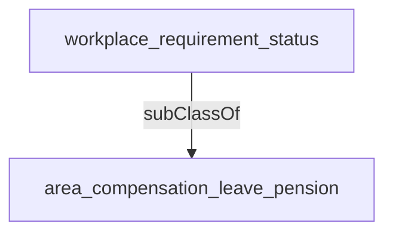

## Related Links

- [[area_compensation_leave_pension]]
- [[workplace_requirement_status]]

## Semantic Connections

```mermaid
graph TD
  workplace_requirement_status["workplace_requirement_status"]:::current-page-node
  area_compensation_leave_pension["area_compensation_leave_pension"]
  workplace_requirement_status-->|" subClassOf "|area_compensation_leave_pension
```
