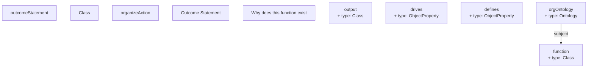

# outcomeStatement

---

### Semantic Connections

```mermaid
graph TD
  outcomeStatement["outcomeStatement"]
  Class["Class"]
  organizeAction["organizeAction"]
  Outcome_Statement["Outcome Statement"]
  Why_does_this_function_exist["Why does this function exist"]
  function["function<br>+ type: Class"]
  output["output<br>+ type: Class"]
  drives["drives<br>+ type: ObjectProperty"]
  defines["defines<br>+ type: ObjectProperty"]
  orgOntology["orgOntology<br>+ type: Ontology"]
  orgOntology-->|" subject "|function
```