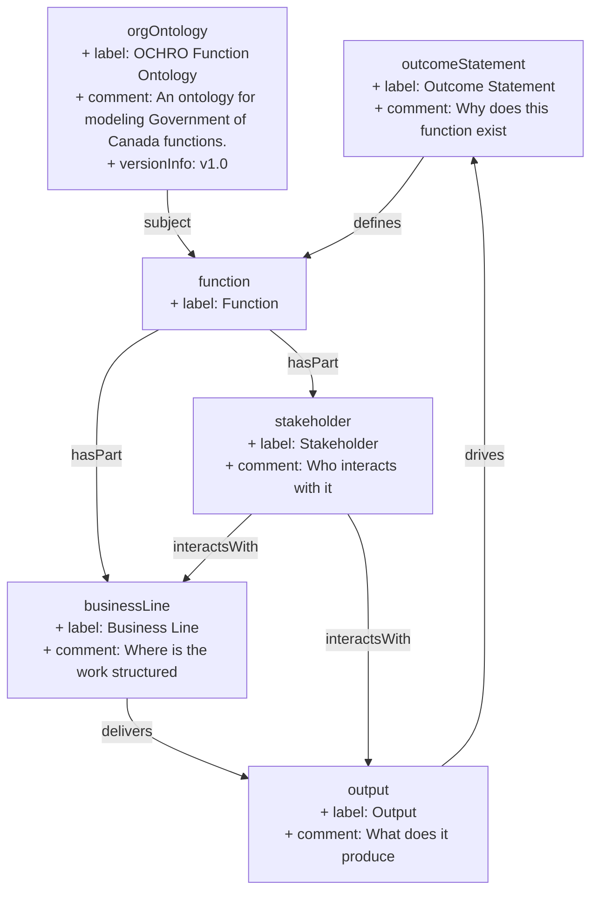

## Related Links

- [[businessline]]
- [[function]]
- [[output]]
- [[stakeholder]]

## Semantic Connections

```mermaid
graph TD
  outcomeStatement["outcomeStatement<br>+ label: Outcome Statement<br>+ comment: Why does this function exist"]:::current-page-node
  function["function<br>+ label: Function"]
  output["output<br>+ label: Output<br>+ comment: What does it produce"]
  stakeholder["stakeholder<br>+ label: Stakeholder<br>+ comment: Who interacts with it"]
  businessLine["businessLine<br>+ label: Business Line<br>+ comment: Where is the work structured"]
  orgOntology["orgOntology<br>+ label: OCHRO Function Ontology<br>+ comment: An ontology for modeling Government of Canada functions.<br>+ versionInfo: v1.0"]
  orgOntology-->|" subject "|function
  businessLine-->|" delivers "|output
  output-->|" drives "|outcomeStatement
  function-->|" hasPart "|businessLine
  stakeholder-->|" interactsWith "|output
  stakeholder-->|" interactsWith "|businessLine
  outcomeStatement-->|" defines "|function
  function-->|" hasPart "|stakeholder
```
