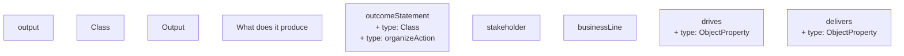

# Output

---

### Semantic Connections

```mermaid
graph TD
  output["output"]
  Class["Class"]
  Output["Output"]
  What_does_it_produce["What does it produce"]
  outcomeStatement["outcomeStatement<br>+ type: Class<br>+ type: organizeAction"]
  stakeholder["stakeholder"]
  businessLine["businessLine"]
  drives["drives<br>+ type: ObjectProperty"]
  delivers["delivers<br>+ type: ObjectProperty"]
```