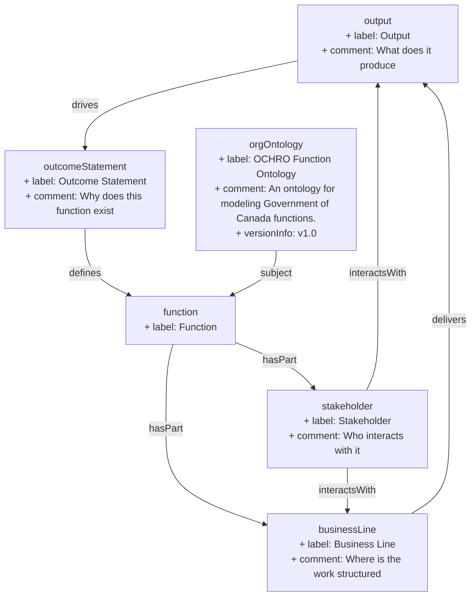

# Output

### Semantic Connections

```mermaid
graph TD
  output["output<br>+ label: Output<br>+ comment: What does it produce"]:::current-page-node
  outcomeStatement["outcomeStatement<br>+ label: Outcome Statement<br>+ comment: Why does this function exist"]
  stakeholder["stakeholder<br>+ label: Stakeholder<br>+ comment: Who interacts with it"]
  businessLine["businessLine<br>+ label: Business Line<br>+ comment: Where is the work structured"]
  function["function<br>+ label: Function"]
  orgOntology["orgOntology<br>+ label: OCHRO Function Ontology<br>+ comment: An ontology for modeling Government of Canada functions.<br>+ versionInfo: v1.0"]
  function-->|" hasPart "|stakeholder
  stakeholder-->|" interactsWith "|output
  function-->|" hasPart "|businessLine
  businessLine-->|" delivers "|output
  outcomeStatement-->|" defines "|function
  output-->|" drives "|outcomeStatement
  stakeholder-->|" interactsWith "|businessLine
  orgOntology-->|" subject "|function
```