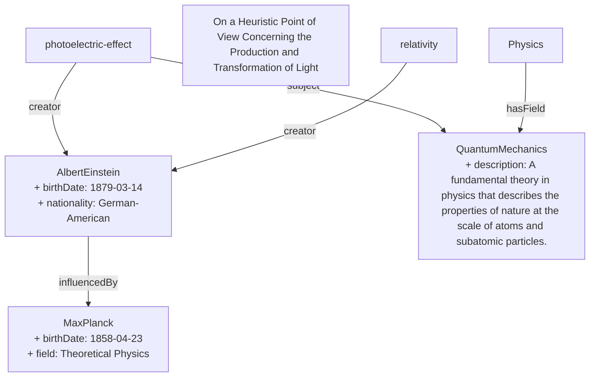

# On a Heuristic Point of View Concerning the Production and Transformation of Light

A topic related to Albert Einstein's 1905 paper.

---

### Semantic Connections

```mermaid
graph TD
  photoelectric_effect["photoelectric-effect"]
  On_a_Heuristic_Point_of_View_Concerning_the_Production_and_Transformation_of_Light["On a Heuristic Point of View Concerning the Production and Transformation of Light"]
  AlbertEinstein["AlbertEinstein<br>+ birthDate: 1879-03-14<br>+ nationality: German-American"]
  photoelectric_effect-->|" creator "|AlbertEinstein
  QuantumMechanics["QuantumMechanics<br>+ description: A fundamental theory in physics that describes the properties of nature at the scale of atoms and subatomic particles."]
  photoelectric_effect-->|" subject "|QuantumMechanics
  Physics["Physics"]
  Physics-->|" hasField "|QuantumMechanics
  MaxPlanck["MaxPlanck<br>+ birthDate: 1858-04-23<br>+ field: Theoretical Physics"]
  AlbertEinstein-->|" influencedBy "|MaxPlanck
  relativity["relativity"]
  relativity-->|" creator "|AlbertEinstein
```