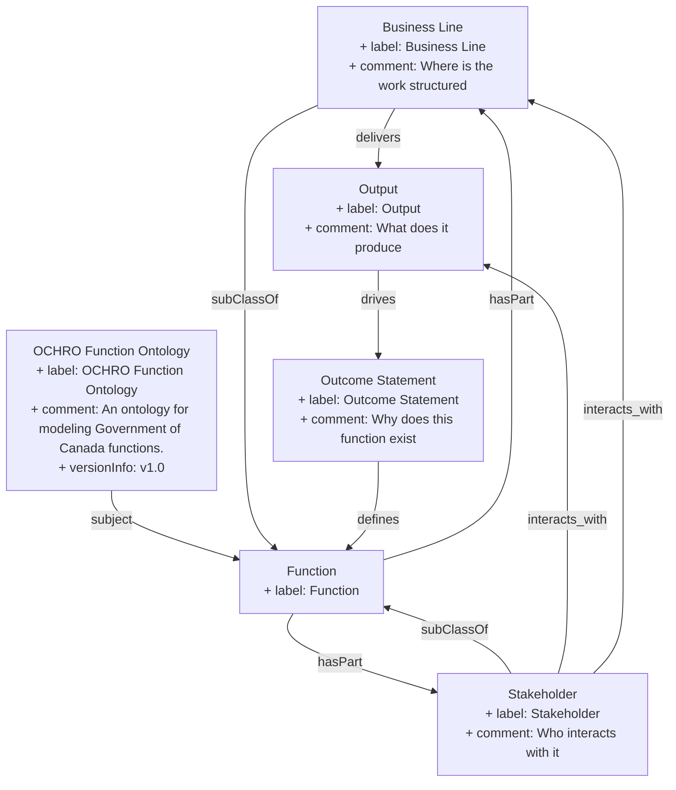

## Related Links

- [[function]]
- [[orgOntology]]
- [[outcome_statement]]
- [[output]]
- [[stakeholder]]

## Semantic Connections

```mermaid
graph TD
  Business_Line["Business Line<br>+ label: Business Line<br>+ comment: Where is the work structured"]:::current-page-node
  Function["Function<br>+ label: Function"]
  Output["Output<br>+ label: Output<br>+ comment: What does it produce"]
  Stakeholder["Stakeholder<br>+ label: Stakeholder<br>+ comment: Who interacts with it"]
  OCHRO_Function_Ontology["OCHRO Function Ontology<br>+ label: OCHRO Function Ontology<br>+ comment: An ontology for modeling Government of Canada functions.<br>+ versionInfo: v1.0"]
  Outcome_Statement["Outcome Statement<br>+ label: Outcome Statement<br>+ comment: Why does this function exist"]
  Function-->|" hasPart "|Business_Line
  OCHRO_Function_Ontology-->|" subject "|Function
  Business_Line-->|" delivers "|Output
  Stakeholder-->|" subClassOf "|Function
  Business_Line-->|" subClassOf "|Function
  Stakeholder-->|" interacts_with "|Output
  Outcome_Statement-->|" defines "|Function
  Output-->|" drives "|Outcome_Statement
  Function-->|" hasPart "|Stakeholder
  Stakeholder-->|" interacts_with "|Business_Line
```
