## Related Links

- [[access_to_information_act]]
- [[canada_evidence_act]]
- [[department_of_justice_act]]
- [[emergency_management_act]]
- [[financial_administration_act]]
- [[library_and_archives_of_canada_act]]
- [[official_languages_act]]
- [[personal_information_protection_and_electronic_documents_act]]
- [[policy_service_digital_8]]
- [[policy_service_digital_8_1]]
- [[privacy_act]]
- [[public_service_employment_act]]
- [[security_of_information_act]]
- [[service_fees_act]]
- [[shared_services_canada_act]]
- [[statistics_act]]

## Semantic Connections

```mermaid
graph TD
  Canada_Evidence_Act["Canada Evidence Act<br>+ label: Canada Evidence Act"]:::current-page-node
  c_5["c-5"]
  Reference_legislations["Reference legislations<br>+ label: Reference legislations"]
  Section_8___References___Policy_on_Service_and_Digital["Section 8 - References - Policy on Service and Digital<br>+ label: Section 8 - References - Policy on Service and Digital"]
  Access_to_Information_Act["Access to Information Act<br>+ label: Access to Information Act"]
  Department_of_Justice_Act["Department of Justice Act<br>+ label: Department of Justice Act"]
  Emergency_Management_Act["Emergency Management Act<br>+ label: Emergency Management Act"]
  Financial_Administration_Act["Financial Administration Act<br>+ label: Financial Administration Act"]
  Library_and_Archives_of_Canada_Act["Library and Archives of Canada Act<br>+ label: Library and Archives of Canada Act"]
  Official_Languages_Act["Official Languages Act<br>+ label: Official Languages Act"]
  Personal_Information_Protection_and_Electronic_Documents_Act_Part_2["Personal Information Protection and Electronic Documents Act Part 2<br>+ label: Personal Information Protection and Electronic Documents Act (Part 2)"]
  Privacy_Act["Privacy Act<br>+ label: Privacy Act"]
  Public_Service_Employment_Act["Public Service Employment Act<br>+ label: Public Service Employment Act"]
  Security_of_Information_Act["Security of Information Act<br>+ label: Security of Information Act"]
  Service_Fees_Act["Service Fees Act<br>+ label: Service Fees Act"]
  Shared_Services_Canada_Act["Shared Services Canada Act<br>+ label: Shared Services Canada Act"]
  Statistics_Act["Statistics Act<br>+ label: Statistics Act"]
  Reference_legislations-->|" hasPart "|Shared_Services_Canada_Act
  Reference_legislations-->|" hasPart "|Financial_Administration_Act
  Reference_legislations-->|" hasPart "|Privacy_Act
  Reference_legislations-->|" hasPart "|Statistics_Act
  Reference_legislations-->|" source "|Section_8___References___Policy_on_Service_and_Digital
  Reference_legislations-->|" hasPart "|Access_to_Information_Act
  Reference_legislations-->|" hasPart "|Security_of_Information_Act
  Reference_legislations-->|" hasPart "|Canada_Evidence_Act
  Reference_legislations-->|" hasPart "|Library_and_Archives_of_Canada_Act
  Reference_legislations-->|" hasPart "|Official_Languages_Act
  Reference_legislations-->|" hasPart "|Emergency_Management_Act
  Reference_legislations-->|" hasPart "|Service_Fees_Act
  Reference_legislations-->|" hasPart "|Public_Service_Employment_Act
  Reference_legislations-->|" hasPart "|Department_of_Justice_Act
  Reference_legislations-->|" hasPart "|Personal_Information_Protection_and_Electronic_Documents_Act_Part_2
  Canada_Evidence_Act-->|" isReferencedBy "|c_5
```

