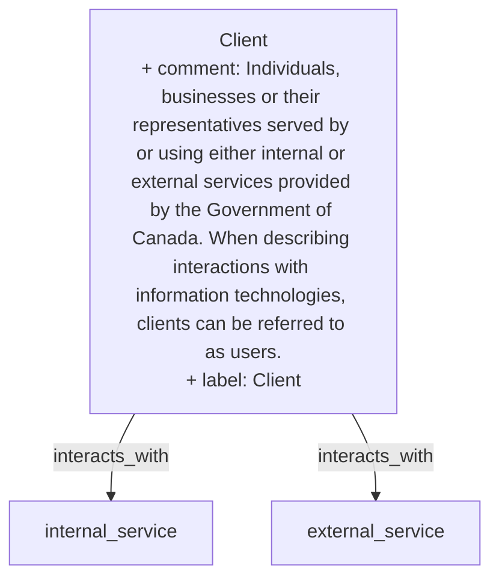

## Semantic Connections

```mermaid
graph TD
  Client["Client<br>+ comment: Individuals, businesses or their representatives served by or using either internal or external services provided by the Government of Canada. When describing interactions with information technologies, clients can be referred to as users.<br>+ label: Client"]:::current-page-node
  internal_service["internal_service"]
  external_service["external_service"]
  Client-->|" interacts_with "|internal_service
  Client-->|" interacts_with "|external_service
```
