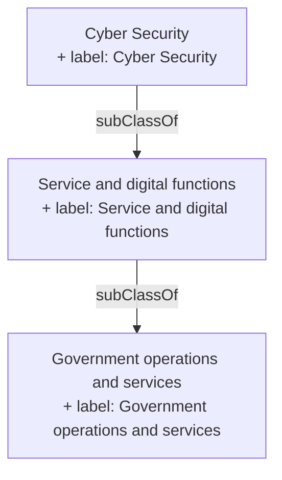

## Related Links

- [[cyber_security]]
- [[government_operations_services]]
- [[service_digital_functions]]

## Semantic Connections

```mermaid
graph TD
  Cyber_Security["Cyber Security<br>+ label: Cyber Security"]:::current-page-node
  Service_and_digital_functions["Service and digital functions<br>+ label: Service and digital functions"]
  Government_operations_and_services["Government operations and services<br>+ label: Government operations and services"]
  Service_and_digital_functions-->|" subClassOf "|Government_operations_and_services
  Cyber_Security-->|" subClassOf "|Service_and_digital_functions
```
